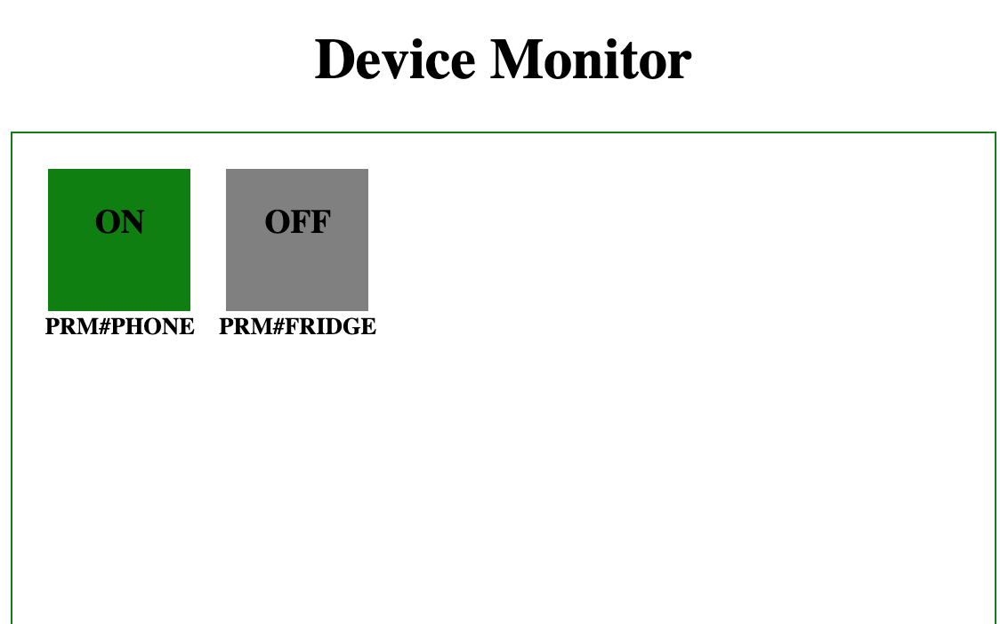

# funicular-dennis

Coding project for NodeJS Engineer Interview. Complete requirements is [here](./REQUIMENTS.md).  
Main goals:

- Devices in the local network can do device paring with mDNS.
- Devices can connect to the hub device via websocket.
- Hub device can hold presence of device with Redis.
- Dockerization: build the service into docker image.
- Test: enough unit tests and some integration tests.
- Chaos Monkey tests.

## Prerequisites

Some stuffs you should get to know first.

### mDNS

In IoT, device paring is a normal but challenging thing. But how can a device connect other devices in the local network? Maybe we should know the ip and port of the device. But usually, IPs are allocated by [DHCP](<https://en.wikipedia.org/wiki/DHCP_(disambiguation)>), so they are dynamic.How can I get IP of the specific device by its name? mDNS can do it.  
[mDNS](https://en.wikipedia.org/wiki/Multicast_DNS)(Multicast DNS), is also known as **ZeroConf** or **bonjour**. A device with mDNS will advertize in the local network by publish its infomation(ip,port,serviceType...) with UDP.Also devices can query services with a specific service type. More info about mDNS, see the [specification](https://tools.ietf.org/html/rfc6762).  
In our case, we need a npm module. [bonjour](https://github.com/watson/bonjour) and [mdns](https://github.com/agnat/node_mdns) both are good choices. We choose **mdns**, as its better documentation.

### WebSocket

We use [socket.io](https://socket.io/docs/) to do our websocket thing here. You can learn a lot from its documentation.

### Redis

Redis is also our common tool. You can set it up and play with it easily.
I always set it up with docker for convenience.

```
$ docker run --name redis -p 6379:6379 -d redis
```

We just use a little here, for production, you should do more configuration.  
Then, we use [ioredis](https://github.com/luin/ioredis) to play with it.

## Architecture

### Basic architecture

The system has two roles: **hub** and **device**.  
**Hub**

- Hub integrates a bonjour service to advertise in the network.
- And it lift a socket.io server to wait for the device connecting.
- Upon connecting, hub will save a presence to redis.
- hold a device monitor, and push presence to device monitor by websocket.

**device**

- The deviceswill integrate a bonjour browser, which search a hub in the network.
- Once find one, it will connect the hub with websocket.

In our system, We will simulate two devices(1 phone and 1 fridge), one hub(one panel). Our architecture may like this:

<div align=center>  </div>
### sequence diagram

TODO

## Usage

First, you should download the repo, and install the dependencies.

```
$ git clone git@github.com:jimbaker/funicular-dennis.git
$ cd funicular-dennis
$ npm install
```

Then, we can run the demo with two ways: **Daemon** and **Docker**.

### Daemon

#### step 1: set up the two device

Code is in folder [device](./device/index.js). You can run it with node.  
 Here, we can define a device name with the environment variable

> A little restriction about deviceName, which should prefix with **PRM#**. In production, maybe some actual way.

**DEVNAME**.

```shell
$ cd ./device
// setup a phone
$ DEVNAME=PRM#PHONE node index.js

// setup a fridge
$ DEVNAME=PRM#FRIDGE node index.js
```

You can see this if it goes right.

```
$ NODE_ENV=DEV DEVNAME=PRM#PHONE node index.js
[2019-03-18T19:17:08.939] [INFO] DEVICE - Device PRM#PHONE is on, components initing ...
[2019-03-18T19:17:08.942] [INFO] DEVICE - mDNS browser init start ...
[2019-03-18T19:17:08.943] [INFO] DEVICE - mDNS browser init DONE.
[2019-03-18T19:17:08.943] [INFO] DEVICE - socket.io client init start ...
[2019-03-18T19:17:08.944] [WARN] DEVICE - No valid host or port, waiting for panel on...
[2019-03-18T19:17:08.944] [INFO] DEVICE - socket.io client init DONE
```

#### step 2: set up hub

Code is in folder [hub](./hub/index.js). You can run it with node. And If you want a specific name, use **DEVNAME** with prefix **PRM#**.

> before this, you should setup Redis first. U can use docker like my way, or another way.

```shell
$ cd ./hub
$ node index.js
```

The panel will set up and advertise in the network. Upon panel`s up and down, the phone and fridge will know it.

```
$ node index.js
[2019-03-18T19:23:52.976] [INFO] PANEL - Server is listening on port:3000
[2019-03-18T19:23:53.975] [INFO] PANEL - A device connected
[2019-03-18T19:23:53.990] [INFO] CACHE - Update presence to redis ok { presence: { 'PRM#PHONE': 'ON' } }
```

#### step 3: device monitor

While we setting up the hub, we also serve a simple page for view the device presence. Open ur browser and input the url. **http://<your hub host ip>:3000**. And you will see the presence in a real time. Green is online, gray is offline.And you can try to crash some device daemon. The device will be gray.

<div align=center>  </div>

Here, phone is online, and fridge is offline.

Okay, for now, you can play with it.

### Docker

TODO

## Test.

We choose [jest]() to test our code. Our tests are all in test folder. You can run it with npm script.

```
$ npm run test
```

## Further

This is a navie demo for now. A lot of thing need to do.

- tests  
  more unit tests and integration tests.
- Chaos Monkey test
